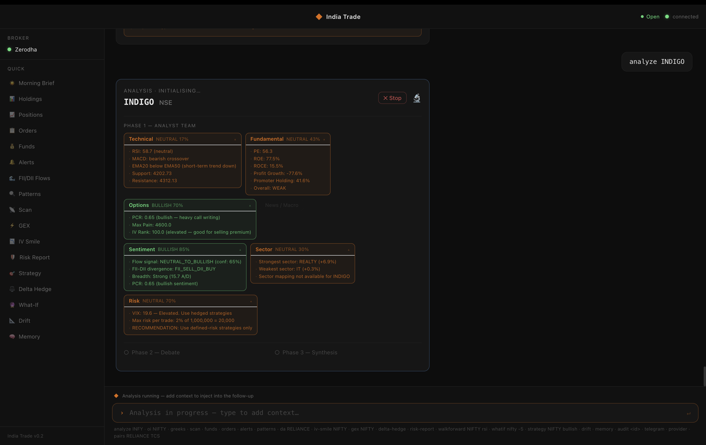
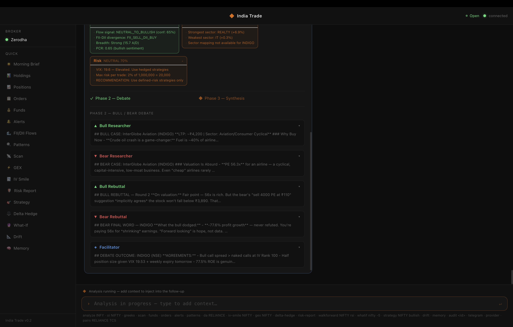
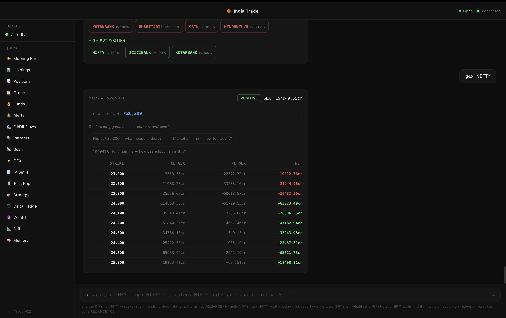
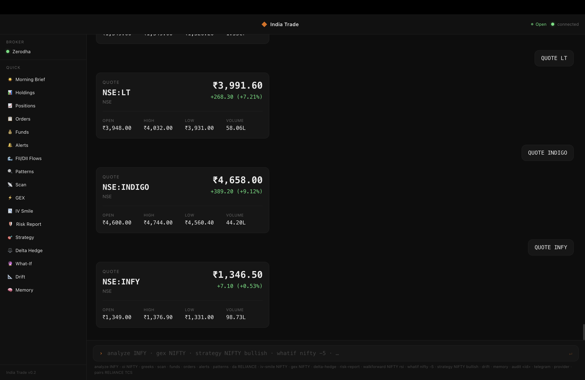
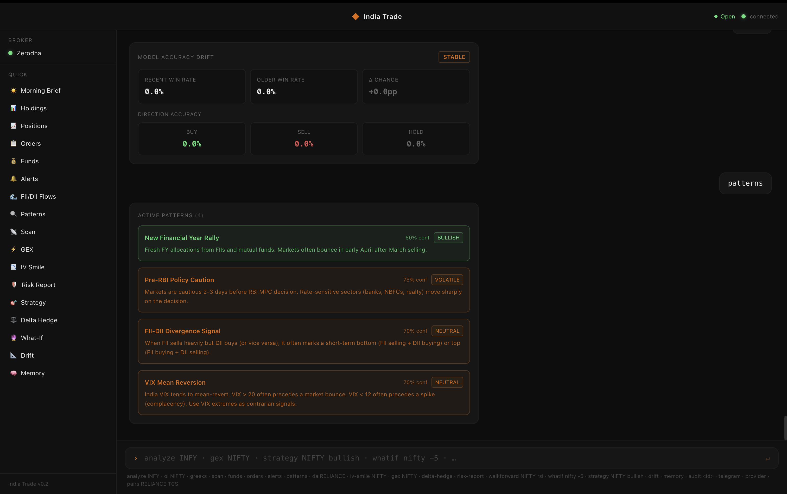
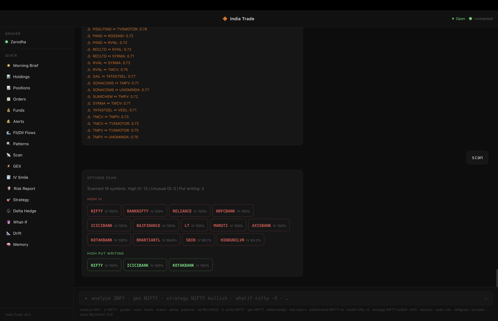

# India Trade CLI

Open-source terminal + macOS app for trading Indian stocks and derivatives (NSE / BSE / NFO). Runs AI analyst agents, backtests quant strategies, places live orders, pushes Telegram alerts, and exposes everything as HTTP skills.

> Every trade must be justified. Analyze first, debate second, execute third.

[](https://github.com/hopit-ai/india-trade-cli/actions/workflows/ci.yml)
[](https://www.python.org/downloads/)
[](LICENSE)

<p align="center">
  
</p>

<p align="center">
  <em>7 AI analysts run in parallel, debate bull vs bear, and deliver a trade plan with entry, stop, and targets.</em>
</p>

<details>
<summary><strong>More screenshots</strong></summary>

| | |
|---|---|
|  |  |
| *Bull/Bear debate with facilitator* | *Gamma Exposure with flip point and action chips* |
|  |  |
| *Live quotes from Zerodha/Fyers* | *India-specific market patterns* |
|  | |
| *Options scanner with OI analysis* | |

</details>

---

## How it works

```
analyze RELIANCE
        |
  7 Analyst Agents  (parallel, pure Python)
  Technical . Fundamental . Options . News . Sentiment . Sector . Risk
        |
  Weighted Scorecard + Conflict Detection
        |
  Multi-Round Debate  (5 LLM calls)
  Bull -> Bear -> Rebuttal -> Rebuttal -> Facilitator
        |
  Fund Manager Synthesis  (1 LLM call)
  Verdict: BUY / SELL / HOLD + confidence + rationale
        |
  3 Risk-Profiled Trade Plans
  Aggressive . Neutral . Conservative -- entry, stop, targets, sizing
```

Standard `analyze`: 8 LLM calls. `deep-analyze`: 11 calls, every analyst fully AI-powered.

---

## Installation

### Prerequisites

- **Python 3.11+** ([download](https://www.python.org/downloads/))
- **Node.js 18+** ([download](https://nodejs.org/)) — only needed for the macOS app
- **Git** ([download](https://git-scm.com/))

### Step 1: Clone and install

```bash
git clone https://github.com/hopit-ai/india-trade-cli.git
cd india-trade-cli
python -m venv .venv && source .venv/bin/activate
pip install -e .
```

### Step 2: Configure AI provider

Copy the example env file and add your API key:

```bash
cp .env.example .env
```

Edit `.env` and set your AI provider (pick one):

```bash
# Free option — Google Gemini
AI_PROVIDER=gemini
GEMINI_API_KEY=your_key_from_aistudio.google.com

# Or — Claude (with Pro/Max subscription, no API key needed)
AI_PROVIDER=claude_subscription

# Or — OpenAI
AI_PROVIDER=openai
OPENAI_API_KEY=your_key

# Or — Ollama (free, local, no key needed)
AI_PROVIDER=ollama
```

### Step 3: Run

**Terminal CLI** (works immediately, no broker needed):
```bash
trade --no-broker
```

Inside the REPL:
```
> analyze RELIANCE
> morning-brief
> strategy library
```

**macOS app** (requires Node.js):
```bash
cd macos-app
npm install
npm run dev
```

The Electron app auto-starts a FastAPI sidecar on port 8765. Includes streaming analysis, 25+ card types, broker panel, and sidebar quick commands.

### Step 4: Connect a broker (optional)

For live market data and trading, connect a broker. See [Broker setup](#broker-setup) below.

Without a broker, the platform uses yfinance (15-min delayed data, no options chain).

### AI provider

| Provider | Cost | How |
|----------|------|-----|
| **Gemini** | Free tier | Key from [aistudio.google.com](https://aistudio.google.com) |
| **Claude** (Pro/Max sub) | Free with subscription | `npm i -g @anthropic-ai/claude-code` -> `claude login` |
| **Claude API** | Pay per token | Key from [console.anthropic.com](https://console.anthropic.com) |
| **OpenAI** | Pay per token | Key from [platform.openai.com](https://platform.openai.com) |
| **Ollama** | Free, local | `ollama pull llama3.1` |
| **OpenRouter / Groq / etc.** | Varies | Set `OPENAI_BASE_URL` in `.env` |

Switch anytime: `provider gemini` or `provider claude_subscription`.

---

## Broker setup

### Recommended: Fyers (data) + Zerodha (execution)

| Function | Broker | Cost |
|----------|--------|------|
| Live quotes, options chain, GEX, IV Smile, historical data | **Fyers** | Free |
| Order placement, holdings, positions, funds | **Zerodha** (Personal plan) | Free |
| **Total** | | **Free** |

Fyers provides the best free market data API for Indian markets (live quotes, options chain with IV/Greeks, WebSocket streaming). Zerodha handles order execution. Both connected simultaneously.

For full Zerodha API features (live quotes via WebSocket, historical candles), use the Connect plan at Rs 500/month.

### Option A: Free setup (Rs 0/month)

1. **Fyers** (data): Create free account at [fyers.in](https://fyers.in) -> [myapi.fyers.in](https://myapi.fyers.in) -> Create App (redirect: `http://127.0.0.1:8765/fyers/callback`)
2. **Zerodha** (execution): Create app at [developers.kite.trade](https://developers.kite.trade) -> Personal plan (free) -> redirect: `http://localhost:8765/zerodha/callback`
3. Add to `.env`:
   ```
   FYERS_APP_ID=XXXX-100
   FYERS_SECRET_KEY=your_secret
   KITE_API_KEY=your_key
   KITE_API_SECRET=your_secret
   ```
4. Register your static IP on Zerodha for order placement (SEBI requirement since April 2026)

### Option B: Fyers only (Rs 0/month)

Use Fyers for everything (data + paper trading). No live order execution.

```
FYERS_APP_ID=XXXX-100
FYERS_SECRET_KEY=your_secret
```

### Option C: Demo mode (Rs 0, no account needed)

```bash
trade --no-broker   # uses yfinance (15-min delayed), no options data
```

### SEBI static IP requirement

Since April 2026, all API orders must be placed from a registered static IP. Check your IP with `curl api.ipify.org` and register it on your broker's developer console. The platform forces IPv4 connections to avoid IPv6 mismatch issues.

---

## What you can do

**[Full command reference ->](docs/commands.md)**

### Analysis
- **`analyze RELIANCE`** -- 7 AI analysts, bull-bear debate, three trade plans
- **`deep-analyze INFY`** -- every analyst uses AI (11 LLM calls, 3-8 min)
- **`morning-brief`** -- daily market brief with FII/DII, breadth, news

### Trading
- **`buy YESBANK 1 17`** -- quick limit buy (1 share at Rs 17)
- **`sell RELIANCE 5`** -- market sell
- **`cancel`** -- interactive order cancellation
- **`mode live`** / **`mode paper`** -- toggle without restart
- **`trade NIFTY BULLISH`** -- guided strategy builder with confirmation

### Options & derivatives
- **`gex NIFTY`** -- gamma exposure with flip point and regime
- **`iv-smile NIFTY`** -- IV skew across strikes
- **`strategy library`** -- 58 curated strategies (26 options + 32 technical)
- **`strategy use iron_condor NIFTY`** -- apply template with live data
- **`greeks NIFTY`** -- portfolio Greeks

### Portfolio
- **`holdings`** -- with today's P&L, overall P&L, and percentages
- **`positions`** -- open F&O positions
- **`funds`** -- available margin and utilisation
- **`risk-report`** -- VaR, volatility, concentration risk

### Data & intelligence
- **`flows`** -- FII/DII flows with directional signals
- **`deals RELIANCE`** -- bulk and block deals
- **`earnings`** -- upcoming results calendar
- **`backtest RELIANCE rsi`** -- strategy backtests on NSE history
- **`pairs HDFCBANK ICICIBANK`** -- pair trading signals
- **`memory`** -- past analyses, verdicts, win rate

### Alerts & notifications
- **`alert NIFTY below 23000`** -- price alerts
- **`telegram setup`** -- Telegram bot for quotes, analysis, alerts on mobile

---

## macOS app features

- Dark theme React UI with Tailwind CSS
- **Streaming analysis** -- analysts appear live as they complete, debate streams in real-time
- **25+ card types** -- Quote, Analysis, GEX, IV Smile, Strategy, Holdings, Funds, Orders, Memory, Morning Brief, Alerts, Risk Report, Delta Hedge, and more
- **Contextual action chips** -- data-aware follow-up questions on every card (e.g. "Put skew +26% at 22,100 -- why?")
- **Broker panel** -- connect Fyers/Zerodha via OAuth from the sidebar
- **Sidebar quick commands** -- one-click access to all tools

---

## Configuration

```bash
# .env  (see .env.example for all options)
AI_PROVIDER=gemini              # gemini | anthropic | openai | claude_subscription
GEMINI_API_KEY=AIza...

TOTAL_CAPITAL=200000            # INR -- used for position sizing
DEFAULT_RISK_PCT=2              # max risk per trade (%)
TRADING_MODE=PAPER              # PAPER or LIVE

NEWSAPI_KEY=...                 # optional -- improves morning-brief quality
TELEGRAM_BOT_TOKEN=...          # optional
```

Position sizing auto-adjusts for VIX: 100% normal -> 85% at VIX 15-20 -> 65% at 20-25 -> 50% above 25.

API keys are stored in the OS keychain (macOS Keychain / Linux SecretService / Windows Credential Locker).

---

## Brokers

| Broker | Data | Execution | Status |
|--------|------|-----------|--------|
| **Fyers** | Live quotes, options chain, WebSocket | Order placement | Fully supported (free) |
| **Zerodha** | Quotes, historical (Rs 500/mo Connect plan) | Order placement | Fully supported -- live orders tested |
| **Mock / Demo** | yfinance (delayed) | Paper trades | Fully supported (`trade --no-broker`) |
| Angel One | Quotes, holdings | Order placement | Implemented, needs testing |
| Upstox | Quotes, holdings | Order placement | Implemented, needs testing |
| Groww | -- | -- | WIP |

### Multi-broker mode

Connect multiple brokers simultaneously. Use one for data, another for execution:

```
Data broker:      Fyers (free, best options data)
Execution broker: Zerodha (your existing demat account)
```

Both stay authenticated. Currently the last-connected broker becomes primary for all operations. Explicit data/execution routing is planned ([#129](https://github.com/hopit-ai/india-trade-cli/issues/129)).

---

## OpenClaw HTTP skills

The macOS app auto-starts the API server. For CLI-only:

```bash
uvicorn web.api:app --host 127.0.0.1 --port 8765
# or from REPL: web
```

Exposes 17+ skills as `POST /skills/<name>`. Discovery: `GET /.well-known/openclaw.json`.

Includes: `quote`, `analyze`, `deep_analyze`, `backtest`, `flows`, `morning_brief`, `chat` (session-aware), `options_chain`, `deals`, `earnings`, `macro`, `alerts/*`, `iv_smile`, `gex`, `strategy`, and more.

> No auth -- keep on `127.0.0.1` or put behind a proxy.

---

## Telegram bot

```
/quote RELIANCE      -- live price
/analyze INFY        -- full multi-agent analysis (3-4 min)
/deepanalyze NIFTY   -- deep AI analysis (7-10 min)
/brief               -- morning brief
/flows               -- FII/DII data
/help                -- all commands
```

Setup: create a bot via @BotFather, add `TELEGRAM_BOT_TOKEN` to `.env`, run `telegram` in the REPL.

---

## Project structure

```
agent/      AI layer -- LLM providers, analyst agents, debate, synthesis
brokers/    Broker integrations -- Fyers, Zerodha, Angel One, Upstox, mock
market/     Market data -- quotes, WebSocket, options chain, news, FII/DII
analysis/   Technical, fundamental, options Greeks, GEX, IV smile, multi-timeframe
engine/     Backtester, 58-strategy library, risk metrics, alerts, trade executor
bot/        Telegram bot
app/        REPL entry point and command handlers
web/        FastAPI -- OAuth + OpenClaw skill endpoints
macos-app/  Electron + React macOS app with streaming UI
```

---

## Roadmap

**Shipped:** 7 analyst agents . scorecard . debate . 3 risk personas . trade memory . backtesting . walk-forward . what-if . FII/DII flows . event strategies . options analytics . VaR/CVaR . DCF valuation . model drift . pair trading . Telegram bot . Fyers WebSocket . paper trading . live trading (Zerodha) . PDF export . OpenClaw skills . 58-strategy library . backtest cache . macOS Electron app . streaming analysis . GEX . IV smile . contextual action chips . buy/sell/cancel CLI . mode toggle

**In progress:** multi-session UI ([#110](https://github.com/hopit-ai/india-trade-cli/issues/110)) . dual-broker mode ([#129](https://github.com/hopit-ai/india-trade-cli/issues/129)) . portfolio-aware personalisation ([#118](https://github.com/hopit-ai/india-trade-cli/issues/118), [#119](https://github.com/hopit-ai/india-trade-cli/issues/119), [#121](https://github.com/hopit-ai/india-trade-cli/issues/121))

**Planned:** app order placement UI ([#130](https://github.com/hopit-ai/india-trade-cli/issues/130)) . TradingView webhooks . SEBI compliance layer . memory improvements ([#122](https://github.com/hopit-ai/india-trade-cli/issues/122))

See [open issues](https://github.com/hopit-ai/india-trade-cli/issues).

---

## Contributing

```bash
pip install -e .
pytest                    # no API keys needed, network tests skipped by default
trade --no-broker         # smoke test
```

See [CONTRIBUTING.md](CONTRIBUTING.md). Most wanted: broker integrations ([#80](https://github.com/hopit-ai/india-trade-cli/issues/80)), app order placement UI ([#130](https://github.com/hopit-ai/india-trade-cli/issues/130)), integration tests ([#79](https://github.com/hopit-ai/india-trade-cli/issues/79)).

---

## Troubleshooting

| Problem | Fix |
|---------|-----|
| `ModuleNotFoundError: kiteconnect` | Broker SDKs are optional. Use Demo mode (`login 0`). |
| NSE API returns empty | NSE rate-limits scrapers. Wait a minute and retry. |
| Fyers `invalid app id hash` | App ID / Secret mismatch. `credentials delete FYERS_APP_ID` then re-login. App ID format: `XXXX-100`. |
| `No active broker session` | Run `login` or `login 0` (demo) first. |
| AI commands error | Run `credentials setup` to configure your AI provider. |
| `keyring` errors on Linux | `sudo apt install gnome-keyring` or set credentials via `.env`. |
| Tests failing locally | `pip install pytest pytest-mock && pytest -m "not network"` |
| Zerodha IP not allowed | Register your IPv4 at developers.kite.trade. Run `curl api.ipify.org` to check. |
| Order rejected (circuit limit) | Price outside NSE circuit band. Use a price within the allowed range. |

---

**Disclaimer:** For educational purposes only. Not financial advice. Trading involves substantial risk of loss. The authors are not responsible for financial losses.

MIT -- see [LICENSE](LICENSE).
